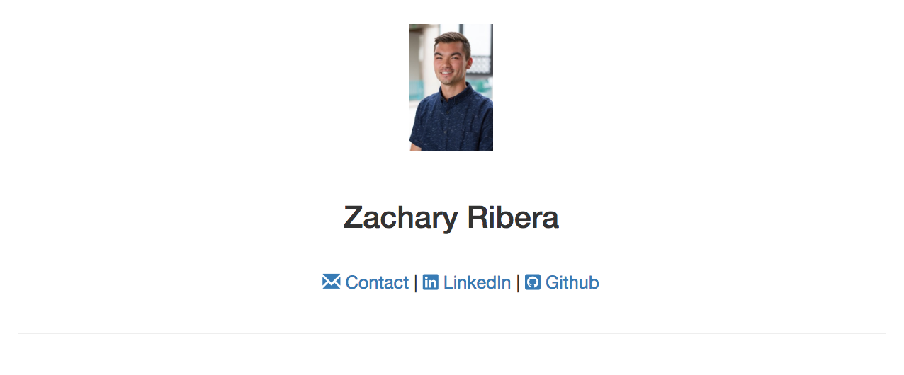
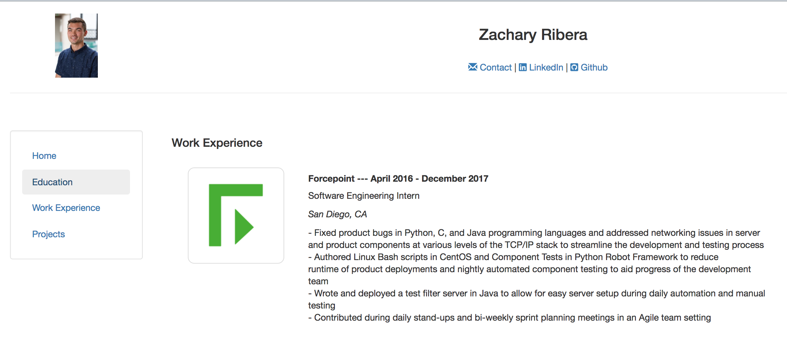

# django-portfolio-site

This a portfolio website created in Django for displaying 'resume-type' information.  
This project was started as an experiement and side-project to learn more about web development and front-end design.

This website was originally hosted on a Digital Ocean droplet with a custom domain name. This website now redirects to my linkedin profile. 

## Contact Information Header

## Work Experience Page

